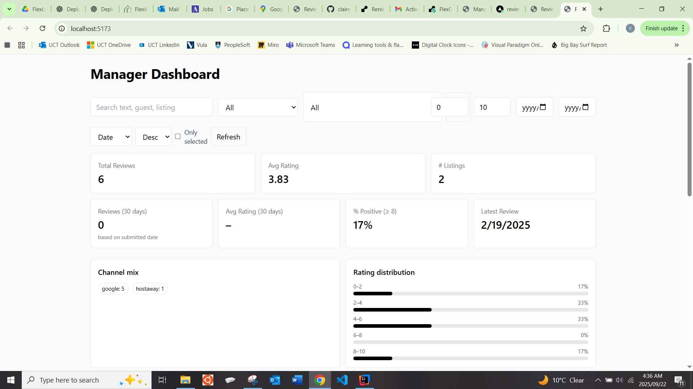
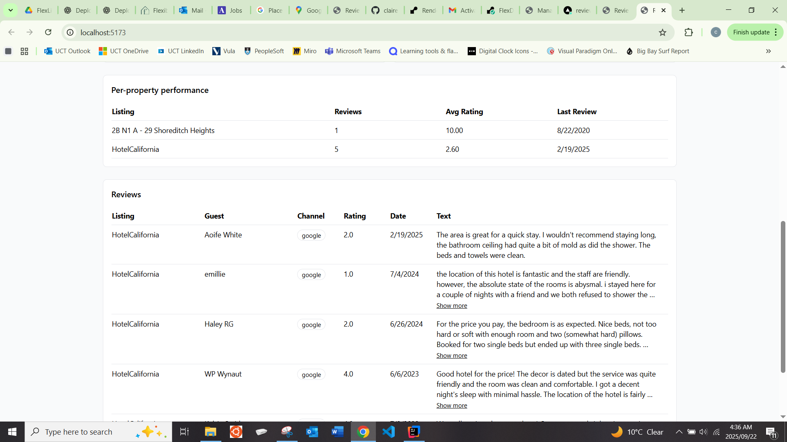
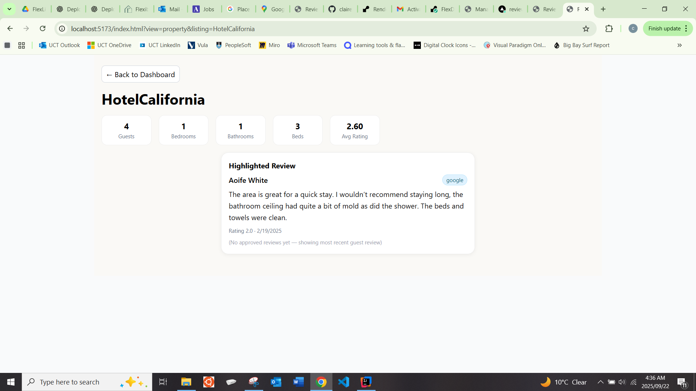

# 📊 Flex Living – Reviews Dashboard

  
  
  
  


---

## 1. 🌟 Introduction

The **Flex Living Reviews Dashboard** is a tool designed to help managers assess property performance based on guest
reviews. It integrates with the **Hostaway Reviews API** (mocked in this project), normalizes review data, and presents
it in a **clean, intuitive dashboard**.

This project combines a **Spring Boot backend** (API + review normalization) with a **React + TypeScript frontend** (
manager dashboard & review display).

📸 Example Manager Dashboard:  



---

## 2. 📌 Scope of Work

### 🔗 Hostaway Integration (Mocked)

- Integration with Hostaway Reviews API (sandboxed).
- Mock review data provided as JSON.
- Normalization by listing, review type, channel, and date.

### 📊 Manager Dashboard

Managers can:

- See **per-property performance**
- **Filter/sort** by rating, category, channel, or time
- **Spot trends** or recurring issues
- Approve reviews for public display

### 🏡 Review Display Page

- Mimics Flex Living property details layout.
- Adds a dedicated **Guest Reviews section**.
- Shows only reviews **approved by managers**.

### 🔍 Google Reviews (Exploration)

- Investigate integration with **Google Places API**.
- Include findings in documentation.

---

## 3. ✅ Evaluation Criteria

The project will be evaluated on:

- Correct handling & normalization of JSON review data.
- **Code clarity** and maintainable structure.
- **UI/UX quality** and design decisions.
- Depth of dashboard insights.
- Problem-solving for undefined/ambiguous requirements.

---

## 4. 📦 Deliverables

- Source code (backend + frontend).
- Running version (locally or deployed).
- Documentation covering:
    - Tech stack
    - Key design/logic decisions
    - API behavior
    - Google Reviews findings (if any).

---

## 5. 🔑 API Access

| Field      | Value                                                              |
|------------|--------------------------------------------------------------------|
| Account ID | `61148`                                                            |
| API Key    | `f94377ebbbb479490bb3ec364649168dc443dda2e4830facaf5de2e74ccc9152` |

> ⚠️ **Note**: This is sandbox-only. Real review data is mocked.

---

## 6. ⚙️ Important Notes

- API route to implement:

```http
GET /api/reviews/hostaway
```

**Response Example**

```json
{
  "status": "success",
  "result": [
    {
      "id": 7453,
      "type": "host-to-guest",
      "status": "published",
      "rating": null,
      "publicReview": "Shane and family are wonderful! Would definitely host again :)",
      "reviewCategory": [
        {
          "category": "cleanliness",
          "rating": 10
        },
        {
          "category": "communication",
          "rating": 10
        },
        {
          "category": "respect_house_rules",
          "rating": 10
        }
      ],
      "submittedAt": "2020-08-21 22:45:14",
      "guestName": "Shane Finkelstein",
      "listingName": "2B N1 A - 29 Shoreditch Heights"
    }
  ]
}
```

---

## 7. 🚀 Getting Started

### Backend (Spring Boot)

```bash
# build and run
mvn clean package
java -jar target/ReviewsDashboard-0.0.1-SNAPSHOT.jar
```

Environment variables:

```bash
export HOSTAWAY_ACCOUNT_ID=61148
export HOSTAWAY_CLIENT_SECRET=your-real-secret
```

### Frontend (React + TypeScript)

```bash
cd frontend
npm install
npm run dev   # local dev
npm run build # production build
```

---

## 8. 📚 Tech Stack

- **Backend**:
    - Java 17+
    - Spring Boot 3.x
    - Maven

- **Frontend**:
    - React 18+
    - TypeScript 5.x
    - Vite

- **Deployment**:
    - Backend → Render / Railway / Fly.io / AWS
    - Frontend → Vercel

---

## 9. 📖 Documentation & Links

- [Spring Boot Docs](https://spring.io/projects/spring-boot)
- [React Docs](https://react.dev/)
- [TypeScript Docs](https://www.typescriptlang.org/docs/)
- [Hostaway API](https://api.hostaway.com/documentation)
- [Google Places API](https://developers.google.com/maps/documentation/places/web-service/overview)

---

## 10. 👩‍💻 Contributing

1. Fork this repo
2. Create your feature branch (`git checkout -b feature/amazing-feature`)
3. Commit changes (`git commit -m 'Add amazing feature'`)
4. Push branch (`git push origin feature/amazing-feature`)
5. Open a Pull Request

---